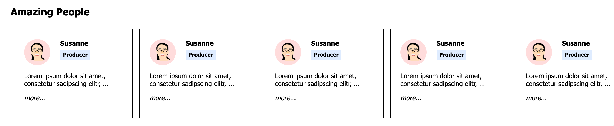

# Amazing People


## Thinking in Components – Amazing People

**Create a new project “amazing-people”. The project should contain a list with your personal famous people (from football, IT, or wherever from, ...)**




The amazing people should be organized within a list
```
<ul>
  <li>....</li>
</ul>
```

Each list item should contain the information of one amazing person.
It should contain following information:

- name
- role
- intro
- image *(loaded from the WWW)*
- link to details *(not linked so far…)*

---

**Try to structure your app in reasonable size of components.
Find parts in the UI, which gets repeated and structure these in components.**

**Also try to apply stylings to your components by using css classes.**

**Use `props` to pass data to child components.**

*A child component is the component which you use within another component. For example we used the `<Section />` component in the `<App />` component in `hello-react`. The `<Section />` component is here the child of the `<App />` component.*


***You should come up with at least 3 components (App doesn't count)***
