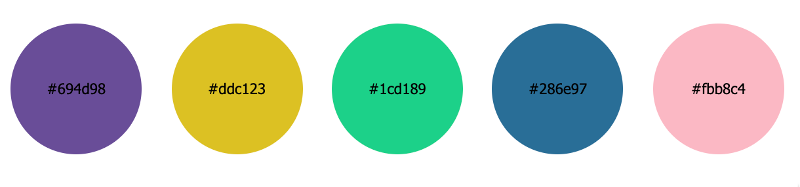

# List “Coloured Circles”

- Create new app “coloured-circles-list”
- define data array with colors, e.g.:

        const colors = [
          "#694d98",
          "#ddc123",
          "#1cd189",
          "#286e97",
          "#fbb8c4",
          "#6e18d3",
          "#7fe376",
          "#f327cf"
        ]

- For each colour in the array, a circle in the given colour needs to be rendered into the view.

- Use the Array.map()-function to iterate through all entries in the array of colours.

